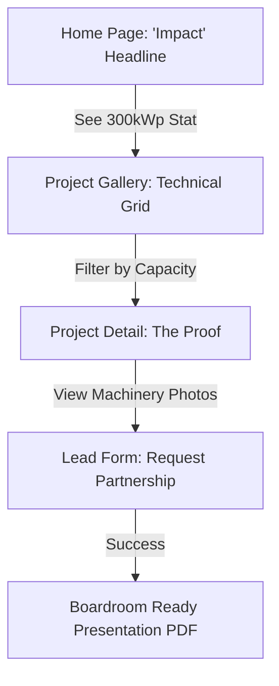
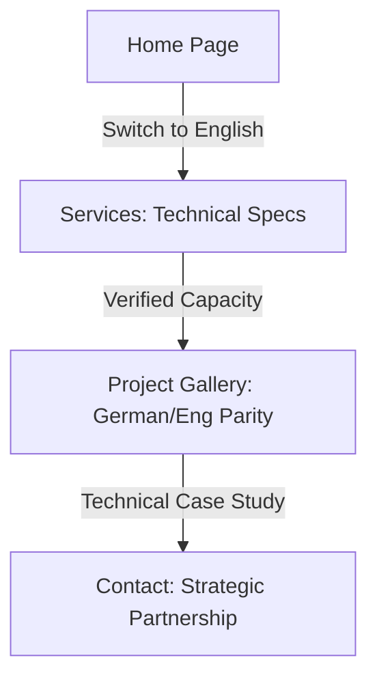
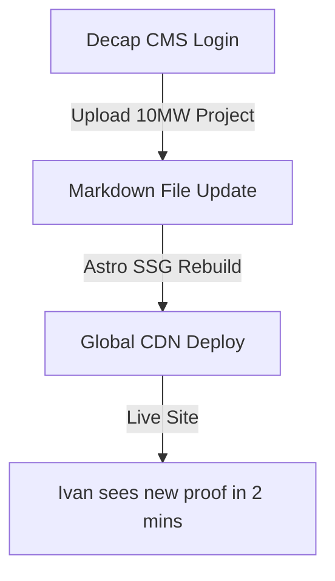

# UX Design Specification green-sunrise

**Author:** Icytank
**Date:** 2026-01-20T16:10:35+02:00

---

## Executive Summary

### Project Vision
The **green-sunrise** digital presence is designed as a high-authority "Office/Boardroom" pitching tool. It eschews the "subcontractor" image for a "Safe/Corporate" aesthetic that emphasizes technical capacity and proven project history. While the site remains fully responsive, its primary UX optimization is for high-stakes presentations and professional scrutiny.

### Target Users
- **Strategic Partners (EPC Leads):** Need immediate proof of technical reliability and past success.
- **International Investors:** Expect a polished, bilingual, and corporate-standard digital footprint.
- **Decision Makers:** Rely on clear, structured data and professional imagery during board reviews.

### Key Design Challenges
- **Corporate Clarity:** Maintaining a "Safe/Corporate" look without feeling dated; ensuring technical data is dense but readable.
- **Data-Rich Gallery:** Presenting 6+ utility-scale projects with complex specs (MW, terrain, location) in a clear, filterable interface.
- **Pitch-First Navigation:** Ensuring the flow of information matches a standard business presentation (Vision -> Capacity -> Proof -> Partnership).

### Design Opportunities
- **Professional Detail:** Using the "Stamp" logo variant to reinforce a "Certified/Verified" feel throughout the interface.
- **High-Performance Presentation:** Using Astro to ensure zero lag during high-stakes boardroom presentations.

---

## Visual Assets Discovered
- **Logos Path:** `/mnt/fastdrive/green-sunrise/logos`
- **Primary Logo:** `green sunrise stamp 1205x165.png`
- **Visual Style:** Safe / Corporate / Trust-centered.

---

## Core User Experience

### Defining Experience
The core experience is **Technical Validation**. The "North Star" interaction is the effortless exploration of the Project Gallery—allowing an investor or EPC lead to verify capacity and scope (kWp/MWp) through structured, professional data visualization.

### Platform Strategy
- **Primary:** Desktop 🖥️ (High-resolution, mouse-driven for boardroom presentations).
- **Secondary:** Mobile 📱 (Fast, information-dense for on-site technician reference).
- **Stack Optimization:** SSG (Astro) ensures zero-lag transitions between projects.

### Effortless Interactions
- **Visual Data Filtering:** Finding projects by MW capacity should feel instantaneous.
- **Bilingual Context Switching:** Switching between EN/BG without losing your place in a project's details.

### Critical Success Moments
- **The "Pitch Win":** When a decision-maker clicks into a project and sees the detailed kWp spec, bilingual description, and professional photography, instantly validating the company's "Safe" corporate status.

### Experience Principles
1. **Unwavering Clarity Over Flair:** Information density (specs) must always be readable and prioritized.
2. **The "Checkmark" Response:** Every design element should reinforce a sense of "Completed/Certified/Verified."
3. **Zero Friction Presentation:** No loading spinners; the site must feel as fast as a native slide deck.
4. **Corporate Trust:** Use the Stamp variant consistently as a mark of quality.

---

## Desired Emotional Response

### Primary Emotional Goals
The primary emotional goal is **Calculated Confidence**. Users should feel that Green Sunrise is a precision-engineered operation that prioritizes reliability and technical accuracy above all else.

### Emotional Journey Mapping
- **Discovery:** "This looks institutional and stable."
- **Core Action (Gallery):** "The data is precise; they aren't hiding anything."
- **Conversion:** "I feel safe recommending this partner to my board."

### Micro-Emotions
- **Trust over Skepticism:** Reinforced by the consistent use of the "Stamp" visual metaphor.
- **Efficiency over Frustration:** Instant loading and clear bilingual parity.
- **Authority over Subordination:** A corporate peer relationship rather than a vendor-subcontractor feel.

### Design Implications
- **Trust → "Stamp" Metaphor:** Use the logo's stamp elements as a design token for "verified" data points.
- **Confidence → Grid Symmetry:** A stable, symmetrical layout to communicate institutional order.
- **Authority → High-Contrast Typography:** Bold, clear headings that don't apologize for their technical detail.

### Emotional Design Principles
- **Institutional Stability:** Avoid trendy or "loud" animations; use subtle, purposeful transitions.
- **Technical Transparency:** Let the specs be the hero of the page.

---

## UX Pattern Analysis & Inspiration

### Inspiring Products Analysis
Based on our discovery, we are prioritizing a **High-Authority / Modern Corporate** hybrid:
- **Benchmark (Modern UI):** Inspired by `modern.corytrimm.com`. 
- **Success Factors:** Ultra-clean horizontal navigation, bold "Impact" numbers for technical results, and a minimalist "Cards-on-Grid" layout that projects stability.
- **Narrative Flow:** Uses a "Problem -> Process -> Result" storytelling pattern which maps perfectly to our Project Gallery (Challenge -> MW Scope -> Result).

### Transferable UX Patterns
- **Standard Horizontal Navigation:** High-contrast header with 5-6 clear pillar links for familiar, professional discovery.
- **Impact Typography:** Using oversized, bold font for key specs (e.g., "300 kWp") to catch the eye of time-pressed Boardroom members.
- **Sectioned Narrative:** Breaking project details into "The Challenge," "Technical Scope," and "The Outcome" to provide a consistent audit trail.
- **Clean Footer:** Dense legal and contact information in a well-structured footer to reinforce institutional validity.

### Anti-Patterns to Avoid
- **Navigation Sidebars:** Avoid sidebars as they can feel too "App-like" or "Dashboard-like," conflicting with the desire for a classic, professional Corporate site. ❌
- **Aggressive Motion:** No parallax or heavy animations that might cause lag during a browser-based presentation. ❌
- **Vague Imagery:** Avoid stock photos of "happy people." Every photo must be a real project or real machinery to maintain authority. ❌

### Design Inspiration Strategy
- **Adopt:** The "Bold Stat" pattern from modern landing pages to highlight MW capacity.
- **Adapt:** High-end architectural grid layouts for the Project Gallery, ensuring it feels like a professional portfolio.
- **Focus:** On "Mouse-First" optimization for desktop boardroom use, while maintaining 100% legibility on mobile.

---

## Design System Foundation

### Design System Choice
**Option 1: Themeable System (Vanilla CSS + Design Tokens)**
We will implement a custom, high-performance design system using Vanilla CSS variables (Tokens) for maximum performance and alignment with the Astro framework.

### Rationale for Selection
- **Performance Excellence:** Ensures <1s FCP and 100/100 Lighthouse scores by avoiding heavy runtime CSS-in-JS libraries.
- **Boardroom Polish:** Allows for 100% bespoke control over the "Safe/Corporate" aesthetic, ensuring the "Stamp" visual metaphors are perfectly integrated.
- **Developer Simplicity:** Provides clear, documented tokens (Colors, Typography, Spacing) for the developer agent to follow without complex framework overhead.

### Implementation Approach
- **Tokens First:** Define CSS variables for all brand colors, font families, and functional spacing.
- **Component-Level Styling:** Lean towards semantic HTML styled with utility-adjacent Vanilla CSS for clarity and maintainability.
- **Template Integration:** As requested, we will leverage existing stable templates (where applicable) for structural foundation while overwriting them with our custom tokens.

### Customization Strategy
- **The "Stamp" Token:** A specialized UI token for badges and validation marks, derived from the `green-sunrise-stamp` logo.
- **Pitch-Optimized Grid:** A 12-column grid system optimized for 4K boardroom presentations and tablet-first pitches.

---

## Defining Core Experience

### Defining Experience
The core interaction is **Technical Validation via the Project Gallery**. We are building an interaction where proof of capacity (kWp/MWp) and past success is effortless, transparent, and instantly accessible to verify the company's "Safe/Corporate" reliability.

### User Mental Model
- **Pre-Interaction:** "I need a partner who won't delay my billion-euro project. Are they real?"
- **Expectation:** Clean, structured technical data that matches international investment standards.
- **Post-Interaction:** "These guys are institutional. The data is clear, the projects are verified. Let's move to a bid."

### Success Criteria
- **Instant Recognition:** MW capacity found in <2 seconds.
- **Bilingual Clarity:** Zero ambiguity in technical translations.
- **The "Verification" Feel:** Users leave feeling they've conducted a successful initial audit.

### Novel UX Patterns
- **The "Data Hero" Card:** Using oversized typography for the "kWp" value as the main visual element of project thumbnails (inspired by `modern.corytrimm.com`).
- **The "Stamp" Validation:** A custom UI badge used across all project cards to signify "Technical Completion."

### Experience Mechanics
1. **Initiation:** High-priority "View Projects" or "Proof of Capacity" call-to-action on the Home page.
2. **Interaction:** A horizontal grid of projects with a persistent "Technical Filter" (Capacity / Period).
3. **Feedback:** Instant, zero-lag card updates via Astro. Hover states reveal high-res machinery photos to double-confirm ownership (visual proof).
4. **Completion:** Every project detail page ends with a direct "Inquiry" lead form pre-populated with the project name for reference.

---

## Visual Design Foundation

### Color System
- **Primary:** `Institutional Green` (#064E3B) — Represents authority and sustainable stability.
- **Secondary:** `Slate Gray` (#334155) — For technical data labels and neutral UI elements.
- **Background:** `Executive White` (#F8FAFC) — A premium, low-glare surface for long meetings and audits.
- **Accent/Success:** `Success Emerald` (#10B981) — Reserved for "Verified" stamps and positive performance indicators.
- **Semantic Mapping:** 
  - `Surface`: #F8FAFC
  - `Text-Primary`: #0F172A (Deep Navy-Slate)
  - `Text-Secondary`: #475569
  - `Border`: #E2E8F0

### Typography System
- **Headings (H1/H2):** **Inter** (Bold/700) — Modern, institutional, and highly legible.
- **Technical Stats (kWp/MWp):** **Geist Mono** — Projects engineering precision and data integrity.
- **Body Text:** **Inter** (Regular/400) — Standardized for effortless reading.
- **Type Scale:** 1.250 (Major Third) for a professional, non-aggressive hierarchy.

### Spacing & Layout Foundation
- **Base Unit:** 8px (Tailwind-compatible scale) for mathematical consistency.
- **Grid Strategy:** 12-column mobile-first grid, optimized for 1440px+ (Boardroom Displays).
- **Layout Principle ("Breathe & Focus"):** Wide horizontal margins (up to 120px on desktop) to center high-priority technical data and photography.

### Accessibility Considerations
- **Contrast Ratios:** All text pairings (Green on White, Slate on White) target WCAG AA (4.5:1+) for presentation legibility.
- **Interactive States:** High-visibility focus rings and clear hover transitions to support mouse-based navigation.

---

## Design Direction Decision

### Design Directions Explored
We explored three primary visual directions for the boardroom pitch context:
1. **Technical Audit:** Data-dense, grid-based, mirrored after investment reports.
2. **The Partner Pitch:** Impact-driven, oversized typography, storytelling-focused.
3. **Minimalist Corporate:** Spacious, premium, leveraging high-end architectural imagery.

### Chosen Direction
**The "Corporate Pitch & Audit" Hybrid**
We have opted for a hybrid strategy that balances immediate "Boardroom Wow" with deep "Technical Validation."

### Design Rationale
- **Impact vs. Proof:** The Home Page identifies with **Direction 2** (Partner Pitch) to capture attention with bold impact metrics (e.g., total kWp capacity). The Project Gallery identifies with **Direction 1** (Technical Audit) to provide the granular proof required for investor due diligence.
- **Institutional Polish:** The entire system leverages the airy spacing of **Direction 3** and the **Stamp Variant** logo as a primary UI decorator for "Completed/Verified" data points.

### Implementation Approach
- **Home Page:** High-contrast sections with large technical headlines.
- **Projects Page:** A symmetrical, dense grid of project cards that feels like a professional portfolio.
- **Single Project Detail:** A narrative flow ("The Challenge," "MW Scope," "Outcome") that provides a consistent audit trail.

---

## User Journey Flows

### Ivan’s "Emergency Proof" Journey
*Goal: Rapidly verify capacity and reliability.*

### Maria’s "International Due Diligence" Journey
*Goal: Conduct technical audit in English.*

### Georgi’s "Audit Freshness" Journey
*Goal: Update site with new technical proof.*

### Journey Patterns
- **Bilingual Persistence:** Language state is preserved across all deep-linked technical specs.
- **The "Audit Trail" Pattern:** Standardized project structure (Challenge -> Scope -> Outcome) for easy comparison.
- **Verification Loop:** Every significant technical milestone redirects to a contact point for "Technical Verification."

### Flow Optimization Principles
1. **MW Priority:** Capacity data is always the first technical item Ivan sees.
2. **Zero-Lag Discovery:** Instant filtering ensures the "Pitch" momentum is never lost.
3. **Seamless Transition:** One-click from "Project Card" to "Technical Inquiry."

---

## Component Strategy

### Design System Components
Since we are building a custom **Token-First (Vanilla CSS)** system, we are creating a library of atomic components optimized for corporate presentation.
- **Foundation Tokens:** Colors, Typography Scale, 8px Spacing Grid.
- **Structural Layouts:** CSS Grid-based 12-column layouts.

### Custom Components

#### 1. The "Impact Stat" Card
- **Purpose:** Immediate "Pitch-Win" visualization on Home Page.
- **Anatomy:** Massive Heading (Primary Green), Secondary Caption (Slate), Optional Status Emoji.
- **Interaction:** None (Purely informational/stat-driven).

#### 2. The "Technical Audit" Card
- **Purpose:** Professional Project Gallery tiles.
- **Anatomy:** 16:9 Image, Bold Project Title, Structured Spec Grid (kWp, terrain, status), GS Stamp badge.
- **Interaction:** Hover reveals secondary technical data ("Audit-on-Hover").

#### 3. The "GS Stamp" Badge
- **Purpose:** Primary visual trust decorator.
- **Anatomy:** Circular or stamp-shaped badge using the `stamp` variant logo.
- **Usage:** Placed on verified data points and project cards.

#### 4. "Audit Narrative" Wrapper
- **Purpose:** Narrative consistency for Single Project pages.
- **Anatomy:** Structured sections for "The Challenge," "Technical Scope," and "The Outcome."

#### 5. Bilingual Navigation Bar
- **Purpose:** Normal horizontal navigation with high authority.
- **Components:** High-contrast logo, 5-6 pillar links, persistent EN/BG switcher.

### Component Implementation Strategy
- **Vanilla Modernity:** Build components using semantic HTML and Vanilla CSS variables (Tokens).
- **Astro Integration:** Each component will be a `.astro` file for zero-runtime performance.
- **Template Baseline:** Use stable structural templates for cards/grids, overwritten with our GS-specific tokens.

### Implementation Roadmap
- **Phase 1 (Core):** Navigation, Impact Stat Card, Project Card.
- **Phase 2 (Content):** Audit Narrative Wrapper, GS Stamp Badge.
- **Phase 3 (Interactive):** Filtering UI, Contact Form blocks.

---
